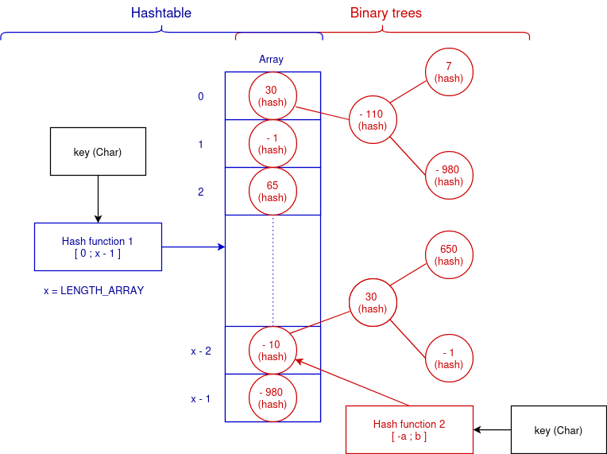
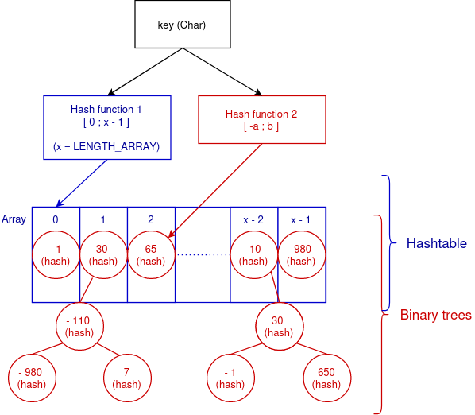

 <center><h2><ins>A project to learn data structures</ins></h2></center>

This project aims to teach myself how data structures work by creating 
a hashtable that store roots of binary trees :

<!--
<p align="center">
    
</p>

<p align="center">
    
</p>

Or horizontally:
-->

<p align="center">
    
</p>

<ins>Balancing the tree:</ins>\
One interesting aspect of this project is to find a way to balance the tree.

If a balanced tree is a tree with the same number of nodes on both sides of the root and of the parents, when it is possible, we could balance the tree by creating a linked-list that order in an ascending order the nodes during the creation of the tree (cf: src/list/sort.c):

<p align="center">
    
</p>

The problem is to find the middle node of the whole list, and the one of the area that represents the subtrees, we would need to create an iteration that goes through each nodes of the list until the middle node, the time complexity would be O(n), which is too much.

One solution would probably be to iterate through each node of the tree, O(log(n)), and make a comparison between the number of nodes to the left and right of iterator_node and the number of nodes it would have to its left and right if it were in a linked-list.

For the root:
- At the node 8, we see that there are two nodes at the right and eight on the left 
  but we need a node with ```floor((float)(((*linked_list_first_element)->counter_node_passed_through) + 1) / 2)``` nodes, 5 in this case, on the left 
  and the right.

  In response, we will go to the path with the most nodes and record the number
  of nodes on the other path + 1 to count the iterator_node, in that case, we go 
  to the left path and we record the number of nodes on the right path + 1, which 
  is $2 + 1 = 3$.

- iterator_node is now at the node on the left path, node 5, we will add to the
  number of node at the same side of the side the number of nodes we previsously 
  recorded.

  In our case, we add $3$ to the number of nodes on the right path, giving 
  $2 + 3 = 5$

  This means that the node is considered to have 5 nodes on the right path
  but it also has 5 nodes on the left, which makes it the root of the 
  balanced tree.

- Finally, to avoid redundant memory, we delete the node 5.

For the lesser child of the root:

For the greater child of the root: